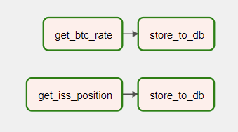

Домашнее задание №3 по курсу [Data Warehouse Analyst](https://otus.ru/lessons/dwh/).  
Цель работы: создать pipeline, получающий данные из публичного API и сохраняющих их в БД.

### DAGs


### Yandex.Cloud

Инфраструктура разворачивается в Яндекс.Облаке при помощи Terraform:
```bash
cd terraform
terraform init
terraform apply
```
при этом:
- создается виртуальная машина с образом Apache Airflow 2, IP-адрес сохраняется в файле `vm-airflow-ip-address.txt`;
- создается экземпляр PostgreSQL;
- в Airflow прописывается connection к базе.

Логин и пароль Airflow отображается в сообщении при подключении по SSH.  
Разворачивание DAG'ов осуществляется при помощи скрипта `deploy_dags.sh`.  
DDL таблиц находится в каталоге `models`.

Для работы DAG'а `get_bitcoin_rate` желательно добавить variable `COINCAP_API_KEY`. 

### Docker
Также можно запустить проект локально при помощи Docker: `docker-compose up -d`  
Открыть в браузере http://localhost:8080/  
- Имя: user
- Пароль: bitnami
- Добавить Connections: `analytics_db=...`  
